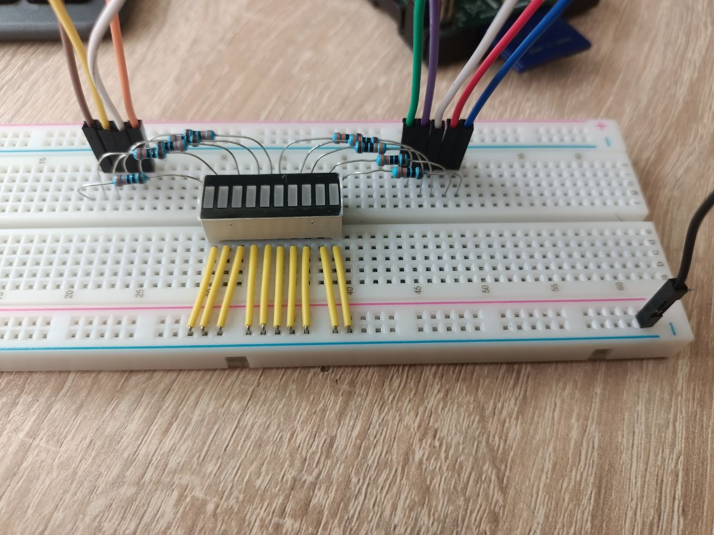
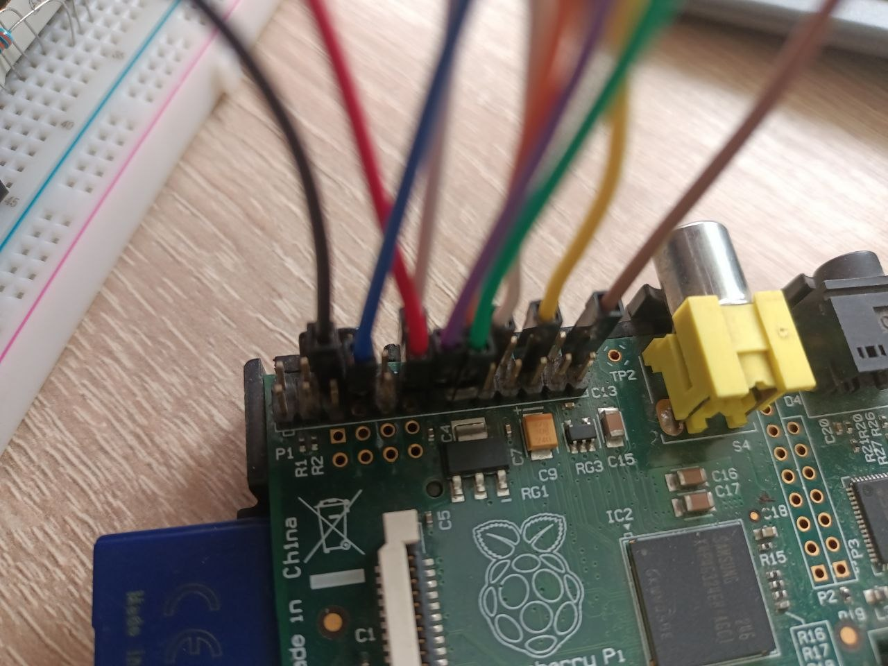

# pi-led-animations

A Python CLI tool for Raspberry Pi that controls a custom 9-LED board through GPIO pins and provides multiple LED animation modes.

---

## Features

- 6 built-in LED animations
- Configurable animation speed
- Adjustable segment length
- Adjustable blink count
- Safe GPIO cleanup on exit
- Raspberry Pi Model B Rev 2.0 compatible
- Lightweight single-file implementation


# 🖥 Hardware Platform

This project was developed and tested on a **Raspberry Pi Model B Revision 2.0** using the standard **26-pin P1 GPIO header**.

**Target platform:** Raspberry Pi Model B Rev 2.0 running Raspberry Pi OS with Python 3 and the `RPi.GPIO` library.

The software uses BCM GPIO numbering:

```python
GPIO.setmode(GPIO.BCM)
```

## P1 Header Pinout

```text
P1:
   3V3 (1) (2) 5V
 GPIO2 (3) (4) 5V
 GPIO3 (5) (6) GND
 GPIO4 (7) (8) GPIO14
   GND (9) (10) GPIO15
GPIO17 (11) (12) GPIO18
GPIO27 (13) (14) GND
GPIO22 (15) (16) GPIO23
   3V3 (17) (18) GPIO24
GPIO10 (19) (20) GND
 GPIO9 (21) (22) GPIO25
GPIO11 (23) (24) GPIO8
   GND (25) (26) GPIO7
```

## GPIO Pins Used

The LED board is connected to the following BCM GPIO pins:

```python
[4, 17, 18, 27, 22, 23, 24, 25, 7]
```

| LED | BCM GPIO | Physical Pin |
|------|---------|--------------|
| 1 | GPIO4 | 7 |
| 2 | GPIO17 | 11 |
| 3 | GPIO18 | 12 |
| 4 | GPIO27 | 13 |
| 5 | GPIO22 | 15 |
| 6 | GPIO23 | 16 |
| 7 | GPIO24 | 18 |
| 8 | GPIO25 | 22 |
| 9 | GPIO7 | 26 |

---

# 🔌 Hardware Setup & Architecture

Each LED is connected to a dedicated GPIO pin through a **330 Ω current-limiting resistor** and shares a common ground connection.

```text
Raspberry Pi GPIO Pin ───[ 330 Ω Resistor ]───(✦ LED)───► GND
```

## Complete 9-LED Wiring Diagram

```text
Raspberry Pi                     LED_BOARD

┌──────────────┐
│ GPIO 4  ├────[ 330 Ω ]────(✦ LED 1 )───┐
│ GPIO 17 ├────[ 330 Ω ]────(✦ LED 2 )───┤
│ GPIO 18 ├────[ 330 Ω ]────(✦ LED 3 )───┤
│ GPIO 27 ├────[ 330 Ω ]────(✦ LED 4 )───┤
│ GPIO 22 ├────[ 330 Ω ]────(✦ LED 5 )───┼───► GND (Common Ground)
│ GPIO 23 ├────[ 330 Ω ]────(✦ LED 6 )───┤
│ GPIO 24 ├────[ 330 Ω ]────(✦ LED 7 )───┤
│ GPIO 25 ├────[ 330 Ω ]────(✦ LED 8 )───┤
│ GPIO 7  ├────[ 330 Ω ]────(✦ LED 9 )───┘
└──────────────┘
```

---

# 📷 Hardware Photos

## Breadboard LED Assembly



*Custom 9-LED board assembled on a breadboard with individual current-limiting resistors.*

## Raspberry Pi GPIO Connection



*LED board connected to the Raspberry Pi GPIO header.*

---

# 🎞 Animation Demonstrations

## Ladder Animation


## Snake Animation


## Ping Pong Animation


## Blink Animation


## Reverse Blink Animation


## Static Mode


---

# 📦 Installation

## Install Dependencies

```bash
sudo apt update
sudo apt install python3 python3-pip
pip3 install RPi.GPIO
```

## Download the Project

Clone the repository:

```bash
git clone https://github.com/<your_username>/pi-led-animations.git
cd pi-led-animations
```

Or download the ZIP archive directly from GitHub:

1. Open the repository page.
2. Click **Code**.
3. Click **Download ZIP**.
4. Extract the archive.

---

# 🚀 Running the Program

The main application is:

```text
LED_animations.py
```

This command-line Python application controls the LED board and provides several configurable animation modes.

---

# ❓ Help

Display all available options:

```bash
python3 LED_animations.py -help
```

Output:

```text
Options:
-help              Show this help message
-time <float>      Set timeout delay (default: 0.5)
-len <int>         Set length (default: 1, max: 8)
-quantity <int>    Set number of flashes for blink modes (default: 5)
-type <str>        Set LED type (default: ladder)

                   [ladder, snake, ping_pong,
                    static, reverse_blink, blink]
```

The `-help` flag displays information about all available parameters and animation modes.

---

# ⚙ Command Line Arguments

## `-type`

Specifies the animation type.

Available modes:

| Mode | Description |
|--------|------------|
| `ladder` | LEDs turn on one by one and then turn off in reverse order |
| `snake` | A moving illuminated segment |
| `ping_pong` | A moving segment bouncing between both ends |
| `static` | All LEDs remain continuously ON |
| `reverse_blink` | LEDs blink from the last LED to the first |
| `blink` | LEDs blink from the first LED to the last |

## `-time`

Sets the animation delay in seconds.

Used by all animation modes.

Example:

```bash
-time 0.4
```

## `-len`

Used only by:

- `snake`
- `ping_pong`

Defines the length of the illuminated LED segment.

Example:

```bash
-len 3
```

## `-quantity`

Used only by:

- `blink`
- `reverse_blink`

Defines how many times each LED flashes before moving to the next LED.

Example:

```bash
-quantity 3
```

---

# 🎨 Animation Modes

## Ladder

LEDs turn on one by one from the first LED to the last. After all LEDs are illuminated, they turn off in the reverse direction.

```bash
python3 LED_animations.py -type ladder -time 0.4
```

## Snake

A continuous illuminated segment moves through the LED strip in a circular fashion.

```bash
python3 LED_animations.py -type snake -time 0.4 -len 3
```

## Ping Pong

An illuminated segment moves from one side to the other and then reverses direction repeatedly.

```bash
python3 LED_animations.py -type ping_pong -time 0.4 -len 3
```

## Static

All LEDs are switched on and remain lit.

```bash
python3 LED_animations.py -type static
```

## Blink

Each LED blinks a specified number of times before moving to the next LED.

```bash
python3 LED_animations.py -type blink -time 0.4 -quantity 3
```

## Reverse Blink

Works like Blink mode but starts from the last LED and moves toward the first.

```bash
python3 LED_animations.py -type reverse_blink -time 0.4 -quantity 3
```

---

# 💡 Example Commands

### Snake Animation

```bash
python3 LED_animations.py -time 0.4 -len 3 -type snake
```

### Reverse Blink Animation

```bash
python3 LED_animations.py -quantity 3 -type reverse_blink -time 0.4
```

### Ping Pong Animation

```bash
python3 LED_animations.py -time 0.4 -type ping_pong -len 3
```

### Ladder Animation

```bash
python3 LED_animations.py -time 0.25 -type ladder
```

### Blink Animation

```bash
python3 LED_animations.py -time 0.2 -quantity 5 -type blink
```

### Static Mode

```bash
python3 LED_animations.py -type static
```

---

# 🛑 Stopping the Program

Press:

```text
CTRL + C
```

The application catches `KeyboardInterrupt` and safely releases all GPIO resources using:

```python
GPIO.cleanup()
```

---

# 📂 Project Structure

```text
pi-led-animations/
│
├── LED_animations.py
├── README.md
│
├── images/
│   ├── breadboard_led_board.jpg
│   └── raspberry_pi_gpio_connection.jpg
│
└── gifs/
    ├── ladder.gif
    ├── snake.gif
    ├── ping_pong.gif
    ├── blink.gif
    ├── reverse_blink.gif
    └── static.gif
```

---

# 📝 License

This project is released under the MIT License.